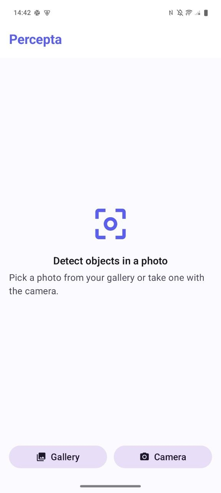
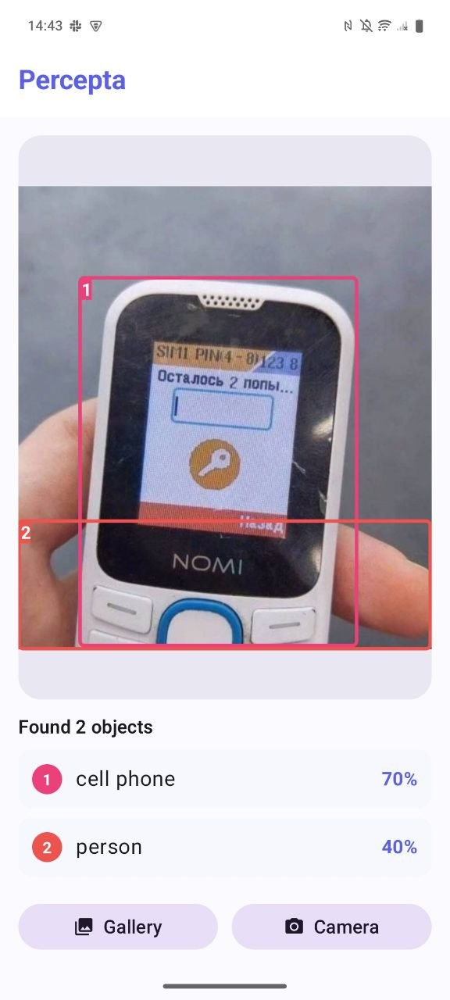
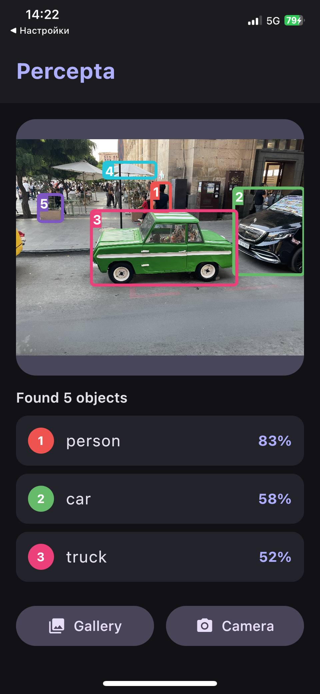

# Percepta

**Cross-platform on-device object detection. Android, iOS & Desktop from a single Kotlin codebase.**


Percepta detects objects in photos (picked from the gallery or captured with the camera) using a **YOLOv8** model running **entirely on-device** via **ONNX Runtime**. The UI, the image processing, and the detection logic are written **once** in Kotlin and run natively on Android, iOS, and Desktop.

> Built as a deep-dive into Kotlin Multiplatform: writing the full ML pipeline by hand (no ready-made SDK), sharing it across three platforms, and integrating a native C/Objective-C inference engine on each.

---

## Screenshots

| Home screen | Detection (light) | Detection (dark) |
|:---:|:---:|:---:|
|  |  |  |
| Android | Android · light theme | iOS · dark theme |

---

## Features

- 🧠 **On-device object detection**: 80 COCO classes (person, car, dog, laptop…), no server required, works offline
- 📷 **Gallery & camera input**: native photo picker and camera on each platform
- 🎯 **Bounding boxes**: per-class colors, numbered badges, and a confidence-ranked results list
- 🌗 **Adaptive theme**: automatic light/dark following the system
- 🧩 **One shared codebase**: UI (Compose Multiplatform), preprocessing, decoding, and NMS all live in `commonMain`
- 🌐 **Optional Ktor backend**: a server that runs detection server-side (learning/experimentation)

---

## How it works

The detection pipeline is implemented by hand. This is the interesting part:

```
 Photo (gallery / camera)
        │
        ▼
 Letterbox preprocess ──►  resize to 640×640 (keep aspect, gray pad),
 (commonMain)              normalize to 0..1, reorder HWC → CHW
        │
        ▼
 ONNX Runtime inference ─► input  [1, 3, 640, 640]
 (expect/actual)           output [1, 84, 8400]
        │
        ▼
 Decode + NMS ──────────►  read 8400 candidates, threshold by confidence,
 (commonMain)              convert boxes, suppress duplicates (IoU)
        │
        ▼
 List<DetectedObject> ──►  drawn as bounding boxes over the photo
```

**Only two things are platform-specific** (behind Kotlin's `expect`/`actual`):

| Concern | Android / Desktop | iOS |
|---|---|---|
| Inference session | `ai.onnxruntime` (Java API) | `onnxruntime-objc` (Obj-C via CocoaPods + Kotlin/Native interop) |
| Image picker / camera | Photo Picker · `UIImagePickerController` on iOS | `PHPickerViewController` · `UIImagePickerController` |

Everything else (the letterbox math, the YOLOv8 decoder, Non-Max Suppression, the `ObjectDetector`, the ViewModel, and the entire Compose UI) is shared Kotlin.

---

## Tech stack

| Area | Technology |
|---|---|
| Language | Kotlin 2.4 (Multiplatform) |
| UI | Compose Multiplatform 1.11 (Material 3) |
| Architecture | MVVM with a multiplatform `ViewModel` + `StateFlow` |
| ML inference | ONNX Runtime 1.29 (Android AAR · JVM · iOS CocoaPods) |
| Model | YOLOv8n (COCO, 80 classes), exported to ONNX |
| Backend (optional) | Ktor 3.5 server + `kotlinx.serialization` |
| iOS interop | Kotlin/Native ↔ Objective-C via CocoaPods |

---

## Project structure

```
Percepta/
├── shared/          # the heart: shared code for all platforms
│   └── src/
│       ├── commonMain/   # UI, ObjectDetector, preprocessing, YOLO decoder, NMS, data models
│       ├── androidMain/   # OnnxSession + pickers (Android)
│       ├── iosMain/       # OnnxSession + pickers (iOS, Obj-C interop)
│       └── jvmMain/       # OnnxSession + picker (Desktop)
├── androidApp/      # Android entry point
├── desktopApp/      # Desktop (JVM) entry point
├── iosApp/          # iOS entry point (Xcode project + CocoaPods)
└── server/          # optional Ktor backend (server-side detection)
```

---

## Getting started

### Prerequisites

- **JDK 21**
- **Android Studio** (with the Android SDK), or IntelliJ IDEA with the Kotlin Multiplatform plugin
- For iOS: **Xcode** (full install, not just Command Line Tools) + **CocoaPods** (`brew install cocoapods`)
- **Python** with `ultralytics` (to export the model, see below)

### 1. Get the model

The `.onnx` model is **not committed** to the repo (it's a large binary). Export it yourself:

```bash
pip install ultralytics
yolo export model=yolov8n.pt format=onnx imgsz=640
```

Then place the generated `yolov8n.onnx` where the apps expect it:

```bash
cp yolov8n.onnx shared/src/commonMain/composeResources/files/yolov8n.onnx
cp yolov8n.onnx server/src/main/resources/yolov8n.onnx   # only if you run the backend
```

### 2. Configure the Android SDK

Create `local.properties` in the project root (if it doesn't exist):

```
sdk.dir=/path/to/your/Android/sdk
```

### 3. Run

**Android**
```bash
./gradlew :androidApp:assembleDebug
```
…or press ▶ on the `androidApp` run configuration.

**Desktop**
```bash
./gradlew :desktopApp:run
```

**iOS** (requires full Xcode + CocoaPods)
```bash
./gradlew :shared:generateDummyFramework
cd iosApp && pod install && cd ..
```
Then open `iosApp/iosApp.xcworkspace` in Xcode (or use the `iosApp` run configuration in Android Studio with the KMP plugin) and run on a simulator or device.

> For a **real iPhone**, set your Apple Team ID in `iosApp/Configuration/Config.xcconfig` and enable automatic signing in Xcode.

---

## Optional: the Ktor backend

A `:server` module runs the same detection pipeline server-side (reusing the shared decoder), exposing a JSON API. Useful for experimenting with larger models (e.g. `yolov8x`) that are too heavy for a phone.

```bash
./gradlew :server:run          # starts on http://localhost:8080
```

```bash
# health check
curl http://localhost:8080/health

# run detection on an image, get JSON back
curl -X POST --data-binary @photo.jpg http://localhost:8080/api/detect
```

Response:
```json
[
  { "classId": 16, "label": "dog", "confidence": 0.91,
    "boundingBox": { "left": 0.30, "right": 0.70, "top": 0.20, "bottom": 0.80 } }
]
```

> Note: from a phone, `localhost` means the phone itself. Use `10.0.2.2` on the Android emulator, or your machine's LAN IP on a real device.

---

<sub>Percepta is a personal learning project exploring Kotlin Multiplatform, Compose Multiplatform, and on-device machine learning.</sub>
